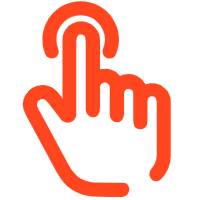
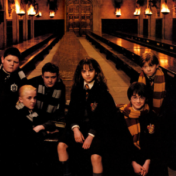

- Reading a little and practicing a lot is the fastest way to learn.
- writing down all you can remember from a studied prose passage—can deepen the memory of that passage better than further study.

```javascript
var thanx = "Thanks for inputing";
alert(thanx);

alert(133); // alert会把括号内的值转换为字符串
```

- Variable names are case sensitive, use camelCase, (a 1 _ $)

- % is the modulus operator. It doesn't give you the result of dividing one number by
another. It gives you the remainder when the division is executed.

- ++/--
```javascript
var num = 1;
var newNum = num++; // newNum = 1, num = 2

var newNum = ++num; // newNum = 2, num = 2
```

- concatenate
```javascript
var name = "michael" + "Jacson" + 111  // 数字会自动转换为string

alert("2" + 2)  // 22
```

- prompt
```javascript
// All responses to prompts come back as strings. 
var spec = prompt("Your species?", "human")  // 第一个参数是提示语，第二个是默认值，返回string
// 如果点了取消，赋值为null
```

- alert + prompt
```
alert("Hello " + prompt("name?", "lucy"));
```

- if
```javascript
var name = prompt("name?", "Lucy");
if (name === "Lucy") {
    alert("Hello " + name);
}
```

- comparison
```javascript
=== // is equal to 
!== // is unequal to 
==  
!=
```

- if...else
```javascript
var name = prompt("your name?");

if (name === "a") {
    alert("a");
}
else if (name === "b") {
    alert("b");
} 
else {
    alert("c")
}

// In a series of if tests, JavaScript stops testing whenever a condition tests true.
```

- &&且 或||

- array
```javascript
var array = [1, "hello", 100, "J", "Life"];
var name = array[1];


var array2 = [];
array2[2] = "hello"; 
array2[6] = "sss"; // 可任意索引赋值，未赋值的则为undefined

array.pop(); // 弹出最后一个element, 不可指定位置
array.push("one", "two"); // 在最后插入

array.length
array["length"]  // 数组长度

// 不能用array[-1]访问最后一个element


var pets = ["cat", "dog", "lamb", "pony"];
pets.shift(); //"cat" 从第一个位置弹出 // pets ["dog", "lamb", "pony"]
pets.unshift("sanke", "hippo"); // 从最开始插入 // pets["sanke", "hippo", "dog", "lamb", "pony"]
pets.splice(2, 1);// ["dog"] 从索引2的位置开始删掉1个元素
pets.splice(2, 0, "pigeon", "parrot"); // 从索引2的位置删掉0个元素并插入指定的元素 // pets ["sanke", "hippo", "pigeon", "parrot", "lamb", "pony"]
pets.slice(2,4);// ["pigeon", "parrot"] // 索引2到3的切片，不包括4
```


- for loop
```javascript
// i stands for "iteration." 迭代
var pets = ["cat", "dog", "lamb", "pony"];
var len = pets.length;  // get the length of an array
var matchFound = false; // a flag for matching
for (var i = 0; i < len; i++) {
    if (pets[i] === "poney") {
        matchFound = true;
        alert("Good for you!");
        break; // break out
    }
}

if (matchFound === false) {
    alert("Not Found!");
}

// loop nested
var firstNames = ["BlueRay ", "Upchunk ", "Lojack ", "Gizmo ", "Do-Rag "];
var lastNames = ["Zzz", "Burp", "Dogbone", "Droop"];
var fullNames = [];
for (var i = 0; i < firstNames.length; i ++) {
    for (var j = 0; j < lastNames.length; j++) {
        fullNames.push(firstNames[i] + lastNames[j]);
    }
}

for (i = 0; i < fullNames.length; i++) {
    console.log(fullNames[i]);
}


var city = prompt("Your city?");
alert(city.toLowerCase());  // convert to lowercase
alert(city.toUpperCase());  // convert to uppercase
```

- string
```javascript
var str = "hello"
var firstChar = str.slice(0, 1); // the first element
var someChar = str.slice(1)  // from the second to the end
str = firstChar.toUpperCase() + someChar.toLowerCase();

str.length   // get the length of a string

// indexOf()

var message = "He got mugged an hour ago";
var firstChar = message.indexOf("mugged");  // return the index of the first character
if (firstChar !== -1) {
    message = message.slice(0, firstChar) + "married" + message.slice(firstChar + 6);  // replace
}
alert(message);
alert(message.indexOf('a'));
alert(message.lastIndexOf('a')); // return the first index of the first character

var i = 2
message.charAt(i) // identify the character at index i

var lastChar = str.charAt(str.length - 1);

xxx = xxx.replace('a', 'e');  // replace the first 'a' with 'e'
xxx = xxx.replace(/e/g, 'a'); // replace all 'e' with 'a'

```

- 取整
```javascript
Math.round(1.23)  // 四舍五入
Math.ceil(1.1)  // 向上取整
Math.floor(-0.1) // 向下取整

var num = 2.55523223;
num = Math.round(num);
```

- random
```javascript
var bigDecimal = Math.random() // generate a 16-place decimal
// 0.5461486542240981
var improvedNum = (bigDecimal * 6) + 1;  // make a number from 1 to 6.9999999999...
var numberOfStars = Math.floor(improvedNum); // make a number from 1 to 6
```

- 转换
```javascript
"22" - 10
// 12 automatically convert to decimal
"22" + 10
// "2210" automatically convert to string

parseInt("1.233"); // 1
parseFloat("1.232abc"); // 1.232

Number("1.22a"); // NaN
Number("2"); //2
Number("1.22"); //1.22
Number(null); // 0
Number(undefined); // NaN

1.22.toString(); // "1.22"


// round off to specified places
1.5555555.toFixed();  // "2"
1.55555555.toFixed(2);  // "1.56"
```

- Date 
```javascript
var dayNames = ["Sun", "Mon", "Tue", "Wed", "Thu", "Fri", "Sat"];
var now = new Date(); // Date object, get date from the computer system
theDay = now.getDay(); // 0 for Sunday through 6
var nameOfToday = dayNames[theDay];

now.getDay(); // 0-6
now.getDate(); // 1-31
now.getFullYear(); 
now.getHours(); // 0-23
now.getMilliseconds(); // 0-999
now.getTime(); // 1588575001953
now.getSeconds(); // 0-59
now.getMonth(); // 0-11
now.getMinutes() // 0-59


var msDiff = new Date("June 30, 2035").getTime() - new Date().getTime();
var dasTillDoom = Math.floor(msDiff / (1000 * 60 * 60 * 24));

var time = new Date("July 30, 2025 13:23:15");
// Tue May 19 2020 09:03:30 GMT+0800 (中国标准时间)

time.setDate(20);  // 修改日期
time.setYear(2021);

```

- Function
```javascript
function tellTime() {
    var now = new Date();
    var hour = now.getHours();
    var minute = now.getMinutes();
    alert("Time: " + hour + ":" + minute);
}

tellTime();

function showMessage(m, string, num) { // parameters形参
    alert(m + string + num);
}

var month = "May";
showMessage(month, "'s winner is ", 23);  // arguments实参

function calcTot(price) {
    return price + calcShip(price);
}

function doSomething() {
    return "hello";
}

alert(doSomething());
```

- global vs local
>A global variable is one that's declared in the main body of your code—that is, not inside
a function.
>A local variable is one that's declared inside a function. It can be either a parameter of
the function, which is declared implicitly by being named as a parameter, or a variable
declared explicitly in the function with the **var** keyword.
```javascript
// 1
var hey = "hello";
function doSth(){
    hey = "ddd";
}

doSth();
alert(hey);  // ddd

// 2

function doSth(){
  var hey = "ddd";
}

doSth();
alert(hey);  // Error


// 3
function doSth(){
    hey = "ddd";  // without var is global
}

doSth();
alert(hey);  // ddd


// 4
var hey = "Hello";
function doSth(){
    var hey = "ddd";  // without var is global
}

doSth();
alert(hey);  // Hello

// 5

var hey = "Hello";
function doSth(){
    var hey = "ddd";  // global is invalid
    return hey + hey;
}

alert(doSth());  // dddddd

```

- switch
```javascript

var name = "lucy";
switch(name) {
    case "jack" :
      alert("jack");
      break;  // 没有break会一直执行到最后一句After a true case is found, JavaScript not only executes the statement(s) immediately below that case. It executes all the statements for all the cases below it. 
    case "lucy" :
      alert("lucy");
      break;
    default :
      alert("Sorry");
}

```

- while
```javascript
var i = 0;
while(i < 10) {
    alert(i);
    i++;
}

var i = 11;
do {
    alert(i);
    i++;
} while(i < 10);
```

- scripts
```javascript
<script>
  function sayHi() {
    alert("Hello world!");
  }
  function sayBye() {
    alert("Buh-bye!");
  }
</script>

// or
<script src="whatever.js"></script>

// Generally, the best place for scripts, though, is at the end of the body section. This guarantees that CSS styling and image display won't get held up while scripts are loading.
```

- comments
```javascript
// single line

/*
multible
line
*/

// HTML <!-- -->
// CSS /* */
```

- Event
```html
<!-- inline event-handling -->
<!-- href="#"会重新加载当前页面 -->
<!-- onClick isn't case-sensitive. You could write onclick, ONCLICK, or OnClIcK and it would work.-->
    <a href="#" onclick="alert('reload current page')" >reload current page</a>
    <br>
    <a href="JavaScript:void(0)" onclick="alert('do nothing')">do nothing</a>
    <br>
    <a href="JavaScript:void(0)" onclick="popup('Hi');">popup</a>
    <input type="button" value="this is a clickbait, watch out!" onClick="alert('to make or break?');">
    <a href="JavaScript:void(0)"></a>
    
    <input type="text" size="30" onFocus="this.style.backgroundColor='yellow';" onblur="this.style.backgroundColor='white';">

    <script>
        function popup(message) {
            alert(message);
        }

        val = document.getElementById(fieldId).value;  // 读取
        document.getElementById("city").value = cityName; // 传值

        var txt = document.getElementById("div1").innerHTML
        var txt = document.getElementById("div1").innerText

        function makeInvisible() {
            document.getElementById("ugly").className = "hidden";  // 清除掉原有的class，替换成新的
        }
        function makeInvisible() {
            document.getElementById("ugly").className += " hidden";  // 保留原有的class，添加新的
        }

        function swapPic() {
            var pic = document.getElementById("before");
            pic.src = "after-pic.jpg";
        }

        function enlargeForm() {
            var frm = document.getElementById("link1");
            frm.className = "jumbo";
        }

        function makeBig() {
            document.getElementById("p1").style.fontSize = "2em";
        }

        var m = document.getComputedStyle("mainPic").margin;

        var par = document.getElementsByTagName("p");

        for (var i=0; i<par.length; i++) {
            par[i].style.fontFamily = "Verdana, Geneva, sans-serif";
        }

        var pics = document.getElementsByTagName("img");
        var divs = document.getElementsByTagName("div");
        var ulists = document.getElementsByTagName("ul");
    </script>

```

- DOM document object model
Starting at the bottom of the chart, the text "Nor to this." is a child of <p>, which is a child of <div>, which is a child of <body>, which is a child of <html>, which is a child of the document.

```javascript
var d = document.getElementById("ny");
var p = d.childNodes[1]; // 2nd child
var contents = p.innerHTML;

var nType = targetNode.nodeType; // 1 element, 3 text


var targetNode = parentNode.firstChild;
var targetNode = parentNode.lastChild;
var targetNode = kidNode.parentNode;
var targetNode = firstEl.nextSibling;
var targetNode = firstEl.previousSibling;

var parent = document.getElementById("div1");
var target = parent.firstChild;
nName = target.nodeName; // P, IMG, #text
nValue = target.nodeValue; // element的value是null

var parentNode = document.getElementById("d1");
var nodeList = parentNode.childNodes;   // 类似于getElementsByTagName
var howManyKids = nodeList.length;

var numberPics = 0;
for (var i = 0; i < howManyKids; i++) {
    if (nodelist[i].nodeName.toLowerCase() === "img") {
        numberPics++;
    }
}


var target = document.getdElementById("p1");
var hasClass = target.hasAttribute("class"); // check if it has an attribute called "calss"  , return true/false

var target = document.getElementById("div1");
var attVal = target.getAttribute("class"); // get attribute value

target.setAttribute("class", "special"); // set attribute value

var list = document.getElementById("p1").attributes;
var numOfItems = list.length;
var nName = list[2].nodeName;
var nValue = list[2].nodeValue;


var nodeToAdd = document.createElement("p");
var imgNodeToAdd = document.createElement("img");
nodeToAdd.setAttribute("class", "regular");
imgNodeToAdd.setAttribute("border", "1");
var newTxt = document.createTextNode("Hello!");
nodeToAdd.appendChild(newTxt);

var pNode = document.createElement("p");
var txt = document.createTextNode("forever love");
p.setAttribute("id", "love");
pNode.appendChild(txt);

var parentDiv = document.getElementById("div1");
parentDiv.appendChild(pNode); // at the end

paragraph1 = parentDiv.firstChild;
parentDiv.insertBefore(newParagraph, paragraph1)  

paragraph2 = parentDiv.childNodes[1];
parentDiv.removeChild(paragraph2);

```


